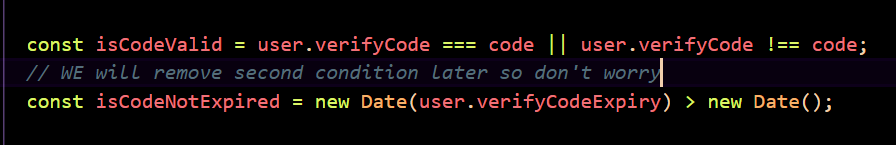

# Feedo: The anonymus comments

Built with ❤️ for community 

<p align="center">
  <a href="https://hackclub.com" target="_blank">
    
  </a>
  <a href="https://feedo-anon.vercel.app" target="_blank">
    
  </a>
</p>

> This is a Fullstack app with a little taste of AI


## Description 
On this app we have 
1. home
2. find users 
3. send a message to specific user 

public routes where anyone can come and send message and the user can resieve those anonymus feedbacks directly in their dashboard.

To become the part of this app or to get feedbacks a user need to Sign up first we have : 

1. signup
2. signin
3. verify 
4. dashboard 

private routes and intersting things is that while writing anonymus feedbacks anonymus sender can get suggestion from AI.


## Teck Stack
- Nextjs - fulll stack solutions
- Vercel AI SDK - for ai agent
- TypeScript - typesafty
- Tailwindcss - styling
- Shadcn UI - for components
- Resend - email verification
- React Hook Form - for forms
- zod - Schemas resolver
- Mongoose - for database models
- Next Auth - authentication
- Axios - api requests

## Good Thing
> This is an open source project

so pathway to use it is divided in some easy baby steps that you can follow and enjoy

1. **Initialize git**

Run this in you terminal - sorry in your computer terminal

```bash
git init
```
2. **Clone repo in your computer system**

```bash
git clone https://github.com/ahmadsiddique-dev/feedo.git
```

3. **Install Packages and dependencies**

```bash
npm i 
```

4. **Run you development server**
```bash
npm run dev
```


# Readme also

Made with  by _**Ahmad Siddique**_

# Here are the Routes names


# Oh btw Read this
> There is an issue with the Email provider as we need to submit our domain name there that we don't have(if you are thinking about vercel domain name then we cannot use it because I don't own it vercel owns it ) So that is why we have enabled to put any random six digit code we will verify it 



But once we have a domain name we will make it so don't worry!